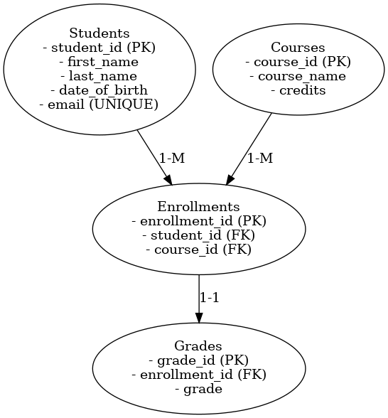

# 🎓 Student Records Management System

## 📌 Project Description
This is a simple relational database system for managing student records using **MySQL**. It includes students, courses, enrollments, and grades, and demonstrates relationships like one-to-many and one-to-one.

## 🛠️ How to Setup

1. Open **MySQL Workbench**
2. Open the `student_records.sql` file
3. Run the script to:
   - Create the database
   - Create tables with proper constraints (PK, FK, NOT NULL, UNIQUE)
   - Insert sample data

## 📐 ERD (Entity Relationship Diagram)

> You can regenerate the ERD using tools like dbdiagram.io or MySQL Workbench's **Reverse Engineer** feature.

## 📁 Files Included

- `student_records.sql` - SQL script to create database, tables, and insert sample data.
- `student_records_erd.png` - Entity Relationship Diagram (ERD)
- `README.md` - This file.

## 🧰 Tech Stack

- MySQL
- MySQL Workbench
